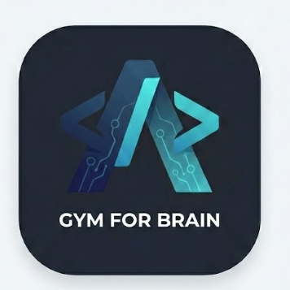

<div align="center">
  
  <h1>Algobox AI</h1>
  <p><strong>Next-Gen Learning Platform - Gym For Brain 🧠</strong></p>

  
  
  %20%7C%20Supabase%20%7C%20Inngest-black?style=for-the-badge)
</div>

**Algobox AI** is an advanced, AI-powered learning platform designed to help users master algorithms, cyber security, and SQL through interactive labs and intelligent feedback.

> **Key Differentiator:** Unlike traditional platforms, Algobox uses an **event-driven architecture (powered by Inngest)** to provide asynchronous AI analysis, personalized roadmaps, and deep code reviews without blocking the user experience.

---

## ✨ Key Features

### 🧠 AI-Powered Learning
- **Real-time Code Analysis:** Instant feedback on algorithm efficiency and edge cases.
- **Mistake Pattern Recognition:** AI Agents analyze your failure history to generate personalized hints.
- **Automated Roadmaps:** Dynamic curriculum adjustment based on user performance.

### 🛡️ Cyber Security Labs
- **Interactive Challenges:** Hands-on labs for SQL Injection, XSS, and more.
- **Deep Security Scans:** Background analysis of submitted payloads for vulnerabilities.
- **Safe Execution Environment:** Sandboxed execution for security practice.

### 📊 SQL & Data Labs
- **Interactive Playground:** Write and execute queries against real datasets.
- **Performance Profiling:** Visual execution plans and query cost analysis.
- **Practice Tracking:** Automated tracking of solved challenges and concepts.

### ⚙️ Event-Driven Backend (New!)
All heavy lifting is offloaded to background workers:
- **Weekly Progress Reports:** Automated analytics via Cron jobs.
- **Gamification Updates:** XP, streaks, and leaderboards processed asynchronously.
- **Smart Notifications:** Email alerts for achievements and suggested practice.

---

## 🛠️ Tech Stack

- **Frontend:** React (Vite), Tailwind CSS, Shadcn UI, Framer Motion
- **Backend/Serverless:** Vercel Serverless Functions
- **Database:** Supabase (PostgreSQL)
- **Background Jobs:** Inngest (Event-Driven Architecture)
- **AI Integration:** LLM Integration for tailored feedback
- **Email:** Resend

---

## 🚀 Getting Started

### 1. Clone the Repository
```bash
git clone https://github.com/Fighterkeshav/algobox-ai.git
cd algobox-ai
```

### 2. Install Dependencies
```bash
npm install
```

### 3. Environment Setup
Create a `.env.local` file in the root directory:
```env
VITE_SUPABASE_URL=your_supabase_url
VITE_SUPABASE_ANON_KEY=your_supabase_key
INNGEST_EVENT_KEY=your_inngest_text_key
INNGEST_SIGNING_KEY=your_inngest_signing_key
RESEND_API_KEY=your_resend_key
```

### 4. Run Development Server
```bash
npm run dev
```
Visit `http://localhost:3000` (or the port shown in terminal).

## 🌐 Live Demo
Check out the live production build: [https://algobox-ai.vercel.app](https://algobox-ai.vercel.app)

### 5. Run Inngest Dev Server (Optional)
To test background functions locally:
```bash
npx inngest-cli@latest dev
```

---

## 🏗️ Architecture

### Inngest Workflows
We use Inngest functions (`api/inngest_core/functions/`) to handle complex logic:

| Function | Trigger | Purpose |
|----------|---------|---------|
| `user-completed-lab` | `user.completed.lab` | Updates XP, calculates streaks, checks milestones. |
| `cyber-practice-submitted` | `cyber.practice.submitted` | Runs security scan + AI deep analysis (slow tasks). |
| `ai-mistake-analysis` | `user.failed.lab` | Analyzes failure patterns after 3 attempts. |
| `weekly-progress-report` | `CRON (Mon 9AM)` | Fans out weekly report events for all active users. |

---

## 🤝 Contributing

We welcome contributions! Please follow these steps:
1. Fork the repository.
2. Create a feature branch (`git checkout -b feature/AmazingFeature`).
3. Commit your changes (`git commit -m 'Add some AmazingFeature'`).
4. Push to the branch (`git push origin feature/AmazingFeature`).
5. Open a Pull Request.

---

## 📄 License

Distributed under the MIT License. See `LICENSE` for more information.

---

*Built with ❤️ by [Fighterkeshav](https://github.com/Fighterkeshav)*
